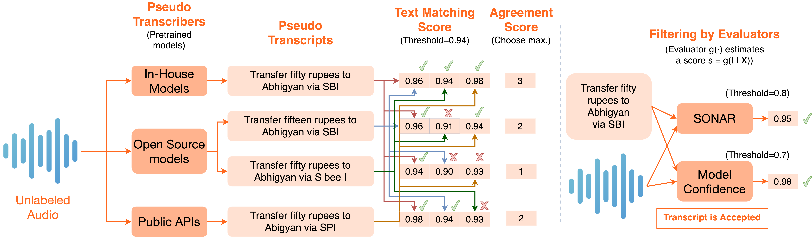

# Pratinidhi: A generic framework for large-scale pseudo-labeling

## Introduction

We tackle the challenge of limited labeled data for low-resource languages in ASR. Specifically, we explore pseudo-labeling, by proposing a generic framework combining multiple ideas from existing works. Our framework integrates multiple base models for transcription and evaluators for assessing audio-transcript pairs, resulting in robust pseudo-labeling for low resource languages. We validate our approach with a new benchmark, INDICYT, comprising diverse YouTube audio files from multiple content categories. Our findings show that augmenting pseudo labeled data from YouTube with existing training data leads to significant performance improvements on INDICYT, without affecting performance on out-of-domain benchmarks, demonstrating the efficacy of pseudo-labeled data in enhancing ASR capabilities for low-resource languages.

## The Pratinidhi Framework

The Pratinidhi framework is a generic framework to large-scale pseudo-labeling. We summarize the key components of the framework in the following figure -



## IndicYT Benchmark

### Why should you use this benchmark?

- Consists of **14** different domains.
- Diverse content across **371** Youtube Channels
- All audios are transcribed by **language experts**. 
- The benchmark is released under a **CC-BY-4.0** License

### Benchmark Statistics

| Domain                 | Dur(mins) | \#Channels | \#Utt |
|------------------------|-----------|------------|-------|
| Business News          | 10.48     | 33         | 76    |
| Cooking                | 11.84     | 76         | 138   |
| Debates                | 7.86      | 6          | 56    |
| Education - Technology | 9.86      | 43         | 110   |
| Headlines              | 7.48      | 19         | 51    |
| Health                 | 9.28      | 18         | 86    |
| Household activities   | 8.57      | 17         | 68    |
| How-to Technology      | 10.24     | 61         | 121   |
| Interviews\_Panels     | 9.53      | 24         | 98    |
| Maths                  | 9.01      | 27         | 86    |
| On-field reporting     | 8.46      | 6          | 64    |
| Science                | 7.30      | 14         | 64    |
| Social Science         | 9.78      | 22         | 84    |
| Sports News            | 8.15      | 5          | 53    |

### Download our Benchmark

| Language | Link     |
|----------|----------|
| Hindi    | [Download(137MB)](https://indic-asr-public.objectstore.e2enetworks.net/indicyt/hindi.zip) |

Coming soon for Assamese, Bengali, Gujarati, Kannada, Malayalam, Marathi, Nepali, Odia, Punjabi, Tamil, Telugu and Urdu!

## Pratinidhi Models

We train Conformer-L models, consisting of 120M parameters, as the encoder, with a hybrid CTC-RNNT decoder. The model has 17 conformer blocks with 512 as the model dimension. All our models are trained using standard recipes from the [NeMo](https://github.com/AI4Bharat/NeMo) library.

### Benchmarking the model on IndicYT

**Baseline model** - Trained on all publicly available labeled datasets for Hindi. Specifically, we extend the previous effort of VISTAAR, which collated 2150 hours of diverse training data for Hindi. We add two recently released Indian language datasets to their collection, viz., INDICVOICES and SPRING-INX, containing 65 hours and 316 hours of training data for Hindi, respectively. The total size of our combined training data is **2531** hours.

**Pratinidhi Model** - Trained on 2531 hours of labeled data + 1840 hours of Pseudo-labeled data. The raw audio for pseudolabeled data was collected from publicly accessible videos from YouTube. We make use of the YouTube Search API to automate the process of discovering videos. The search terms were crafted carefully to ensure diversity in domains in the collected data.


| Domains                | Baseline | Pratinidhi |
|------------------------|----------|------------|
| Headlines              | 25.0     | 19.0       |
| On-field reporting     | 29.7     | 25.3       |
| Debates                | 25.0     | 18.4       |
| Interview - Panels     | 34.4     | 27.3       |
| Sports News            | 29.4     | 24.4       |
| Business News          | 38.5     | 29.4       |
| Education - Technology | 42.2     | 25.8       |
| Health                 | 37.2     | 25.0       |
| Social Science         | 38.2     | 27.8       |
| Maths                  | 38.7     | 29.0       |
| Science                | 38.3     | 23.3       |
| How-to Technology      | 35.6     | 27.6       |
| Cooking                | 26.2     | 18.9       |
| Household activities   | 24.2     | 21.9       |
| **ALL**                | **33.3** | **24.7**   |

### Benchmarking the model on Vistaar

| Model         | Kathbath     | Kathbath-Hard | FLEURS        | CommonVoice   | IndicTTS     | MUCS         | Gramvaani     | Average       |
|---------------|--------------|---------------|---------------|---------------|--------------|--------------|---------------|---------------|
| Google STT    | 14.3         | 16.7          | 19.4          | 20.8          | 18.3         | 17.8         | 59.9          | 23.9          |
| IndicWav2vec  | 12.2         | 16.2          | 18.3          | 20.2          | 15.0         | 22.9         | 42.1          | 21.0          |
| Azure STT     | 13.6         | 15.1          | 24.3          | 14.6          | 15.2         | 15.1         | 42.3          | 20.0          |
| Nvidia-medium | 14.0         | 15.6          | 19.4          | 20.4          | 12.3         | 12.4         | 41.3          | 19.4          |
| Nvidia-large  | 12.7         | 14.2          | 15.7          | 21.2          | 12.2         | 11.8         | 42.6          | 18.6          |
| IndicWhisper  | 10.3         | 12.0          | 11.4          | 15.0          | 7.6          | 12.0         | 26.8          | 13.6          |
| **Pratinidhi**    | **8.9** | **10.1** | **11.9** | **10.6** | **7.7** | **9.0** | **24.2** | **11.9** |


### Download our Models
Hindi NeMo Model Checkpoint - [Download(450MB)](https://indic-asr-public.objectstore.e2enetworks.net/indicyt/ai4b_pratinidhi_hi.nemo)

Coming soon for all 22 official Indian languages!

### Running Inference

```python
import nemo.collections.asr as nemo_asr
asr_model = nemo_asr.models.ASRModel.restore_from("ai4b_pratinidhi_hi.nemo")
transcript = asr_model.transcribe(["path/to/audio_file.wav"])
```

## Acknowledgements 

We would like to thank Digital India Bhashini, the Ministry of Electronics and Information Technology (MeitY) of the Government of India and the Centre for Development of Advanced Computing (C-DAC), Pune for generously supporting this work and providing us access to multiple GPU nodes on the Param Siddhi Supercomputer. We would like to thank the EkStep Foundation and Nilekani Philanthropies for their generous grant which went into hiring human resources as well as cloud resources needed for this work.
